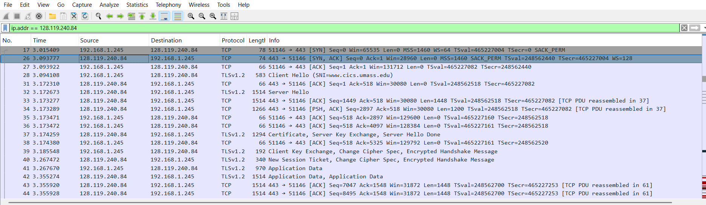
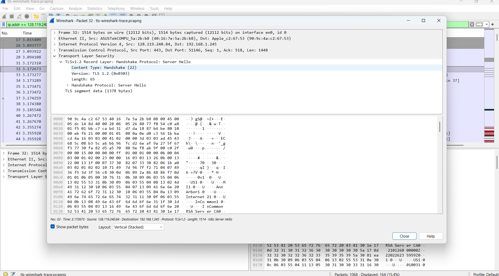
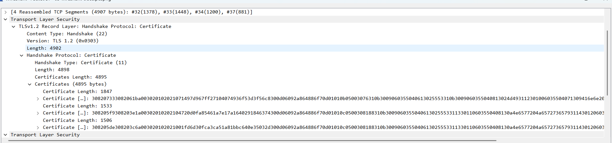

# TLS Traffic Analysis Investigation

## Overview

This investigation analyzes a Transport Layer Security (TLS) session using Wireshark to understand how secure HTTPS connections are established between a client and a web server.

Transport Layer Security (TLS) provides authentication, confidentiality, and integrity for communications over the internet. By examining packet captures in Wireshark, it is possible to observe how a client and server negotiate encryption parameters, exchange certificates, and establish a secure session.

The analysis focuses on the TCP connection establishment, TLS handshake process, certificate exchange, and encrypted application data transmission.

---

## Investigation Environment

**Tool Used**

Wireshark

**Protocols Analyzed**

- TCP  
- TLS 1.2  
- HTTPS

**Investigation Method**

Offline packet capture analysis

---

## Investigation Methodology

The packet capture was analyzed using Wireshark to inspect the sequence of packets exchanged during the establishment of an HTTPS connection.

The investigation focused on identifying the major stages of the secure communication process:

1. TCP three-way handshake
2. TLS Client Hello message
3. TLS Server Hello response
4. Certificate exchange
5. Cipher suite negotiation
6. Encrypted application data transmission

To isolate traffic associated with the HTTPS server, the following Wireshark display filter was used:

```
ip.addr == 128.119.240.84
```

This filter allows analysis of packets exchanged specifically between the client and the target server.

---

## TCP Connection Establishment

Before TLS communication begins, a standard TCP three-way handshake must occur between the client and server.

In the packet capture, the initial **TCP SYN packet occurs at packet #17**, initiating the connection request from the client.

The server responds with a SYN-ACK packet, and the client completes the handshake with an ACK packet. Once these three packets are exchanged, the TCP connection becomes established.

Only after the TCP connection is successfully established does the TLS handshake begin.



---

## TLS Handshake Analysis

After the TCP connection is established, the TLS handshake begins.

The first message sent by the client is the **Client Hello** message. This message informs the server of the cryptographic capabilities supported by the client.

The Client Hello message includes information such as:

- TLS version supported by the client
- List of supported cipher suites
- Random data used in key generation
- Compression methods

The packet capture shows the client declaring support for:

TLS Version  
**TLS 1.2 (0x0303)**

Number of supported cipher suites  
**27 cipher suites**

This allows the server to select a mutually supported cipher suite for the secure session.

---

## Server Hello Response

The server responds with a **Server Hello** message selecting the cryptographic parameters that will be used during the TLS session.

The Server Hello message appears in **packet #32**.

The server selects the following cipher suite:

```
TLS_ECDHE_RSA_WITH_AES_128_GCM_SHA256
```

This cipher suite specifies the following cryptographic mechanisms:

Key Exchange  
Elliptic Curve Diffie-Hellman Ephemeral (ECDHE)

Authentication  
RSA

Encryption Algorithm  
AES-128-GCM

Integrity Protection  
SHA-256

The use of ECDHE provides **forward secrecy**, meaning past encrypted sessions remain secure even if a private key is compromised later.



---

## Certificate Exchange

During the TLS handshake the server sends its **digital certificate** to authenticate its identity.

The certificate exchange appears in **packet #37** within the capture.

The certificate contains the server’s public key and identity information. It is signed by a trusted Certificate Authority (CA) which allows the client to verify the authenticity of the server.

The packet capture shows that multiple certificates are transmitted as part of the certificate chain, including intermediate CA certificates used to validate trust.



---

## Encrypted Application Data

After the TLS handshake completes successfully, encrypted application data begins to flow between the client and server.

Although the contents of these packets cannot be inspected due to encryption, the encryption algorithm can be determined from the negotiated cipher suite.

The symmetric encryption algorithm used in this session is:

```
AES-128-GCM
```

AES-GCM provides both confidentiality and integrity protection for transmitted data.

---

## Key Findings

The packet capture analysis revealed the following observations:

- TCP connection established before TLS handshake begins
- TLS version used: **TLS 1.2**
- Client advertised **27 supported cipher suites**
- Server selected cipher suite: **TLS_ECDHE_RSA_WITH_AES_128_GCM_SHA256**
- Encryption algorithm used: **AES-128-GCM**
- Certificate chain included intermediate certificate authority certificates

These observations demonstrate the sequence of events involved in establishing a secure HTTPS connection.

---

## Conclusion

This investigation demonstrates how TLS establishes secure communication between a client and a web server during an HTTPS session.

The process begins with the TCP three-way handshake, followed by the TLS handshake where encryption parameters are negotiated and the server authenticates itself through digital certificates.

Once the handshake is complete, symmetric encryption is used to securely transmit application data between the client and server.

Understanding the TLS handshake process and encrypted traffic patterns is an essential skill for cybersecurity professionals performing network traffic analysis and investigating secure communications.
